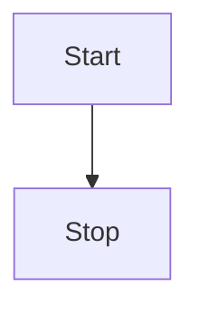
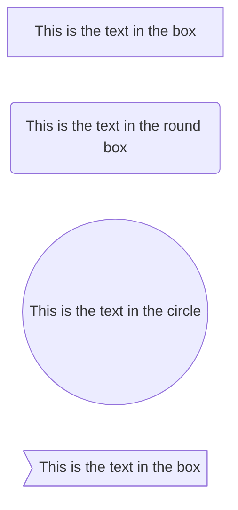
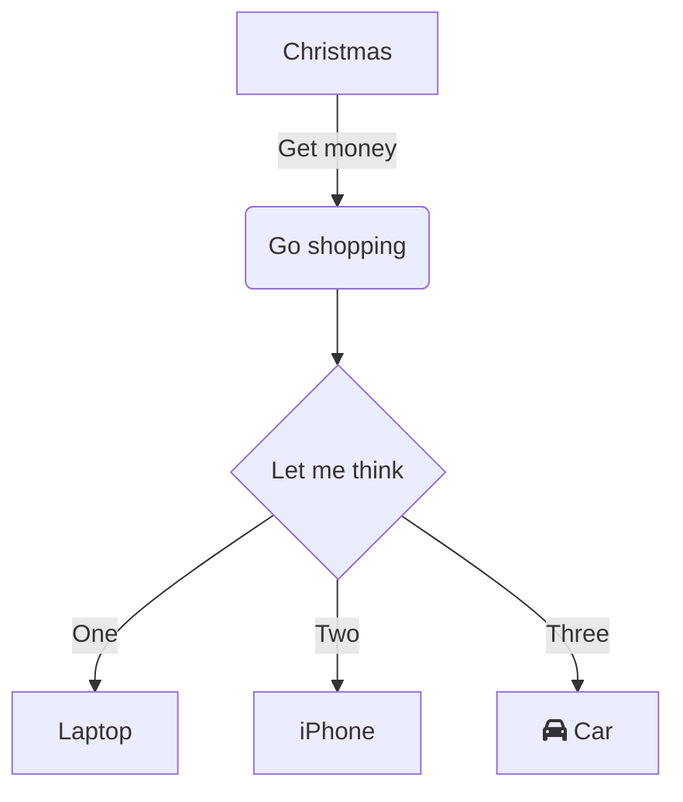

# Haddop Diagram

posible directions
```
TB - top bottom
BT - bottom top
RL - right left
LR - left right
TD - same as TB
```


```mermaid
graph TD
    Start --> Stop

```


```mermaid
graph LR
    id1[This is the text in the box]
    id2(This is the text in the round box)
    id3((This is the text in the circle))
    id4>This is the text in the box]

```


```mermaid
graph TD
    A[Christmas] -->|Get money| B(Go shopping)
    B --> C{Let me think}
    C -->|One| D[Laptop]
    C -->|Two| E[iPhone]
    C -->|Three| F[fa:fa-car Car]
```

## Ref

- https://mermaidjs.github.io